# Single Page Application (SPA) Resumé

## Description

Resumé is a single page web app that displays a user's curriculum vitae as a website.  

## Walkthrough

#### Tools you will need

##### Download and install Visual Studio from the link below 
[Visual Studio](https://www.visualstudio.com)

##### Download and install the Azure SDK from the link below
[Azure SDK](https://azure.microsoft.com/blog/2015/07/20/announcing-the-azure-sdk-2-7-for-net) 

##### When you have all the above resources ready, you can proceed to the step-by-step guide below

### Cloning Repository Using Visual Studio

#### Step 1

To get the clone URL click on the Copy to clipboard button.
 

#### Step 2

On your computer click on start, search for Visual Studio and press enter to open it.

#### Step 3

To clone the repository to your computer you need to open Visual Studio, click on Team Explorer then Manage Connections. 

#### Step 4

Click on clone.

#### Step 5 

Paste the clone URL you got from github into the textbox and click Clone.

### Deploying Web Site To Azure

#### Step 1

Open your browser and type in http://portal.azure.com

#### Step 2

On the sign in page you're going to have to enter your Microsoft Account details.

#### Step 3

When you're signed in, you'll be sent to the Azure portal dashboard.

#### Step 4

To create a new web app click on New → Web+Mobile → Web App. On the web app blade there's a field where you have to supply a name for your web app, the name has to be globally unique because it will be used to make up part of your `azurewebsites.net` URL. You also need to choose a subscription, resource group and a location before you can create the web app.

#### Step 5

After creating the web app, you should be able to view your web app on the resource groups tab.

#### Step 6

After creating your web app, it should be displayed as a tile on your dashboard, if it's not then you can click on Resource Groups to find it.

#### Step 7

Open your project solution in Visual Studio, on the Team Explorer tab double-click on project's local repository, click on the resume.sln file to open it and then open the Solution Explorer tab right-click on the project and click publish.

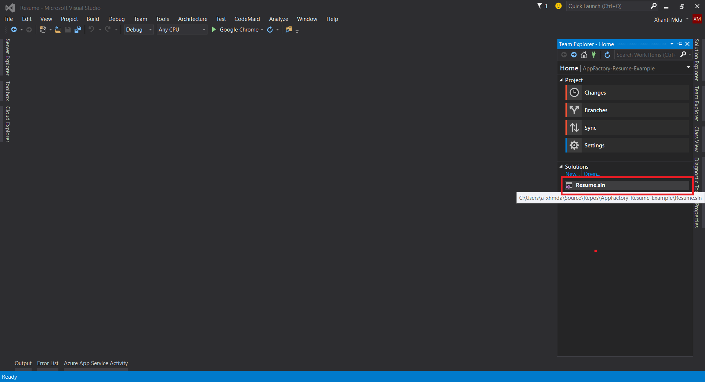

#### Step 8 

On the window that pops up click on Microsoft Azure Web Apps

#### Step 9

You may have to reenter your credentials to connect Visual Studio to your Azure subscription.
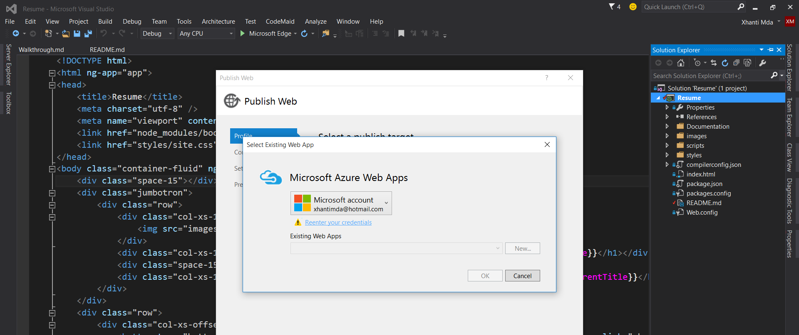

#### Step 10

After Visual Studio connects to your Azure subscription, you should select the one you want and click OK.

#### Step 11 

A window containing the details of the Azure Web App will pop-up, confirm if the information displayed there is correct then click Publish to deploy the app. 

#### Step 12

The output window will display a success message when the deploy is done.

### Changing the information on the resumé

#### Step 1

Open the resume sollution on Visual Studio, on the Solution Explorer tab double-click on the scripts folder and open the resume.ts file.
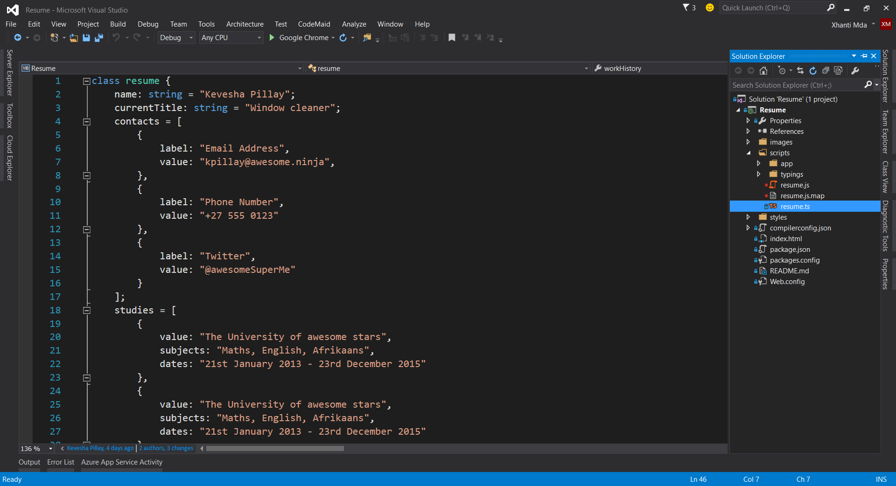

#### Step 2

Once you have the file open you can now replace the profile information with your own. To change the name, find the name property in the resume class and set its value to your name. 
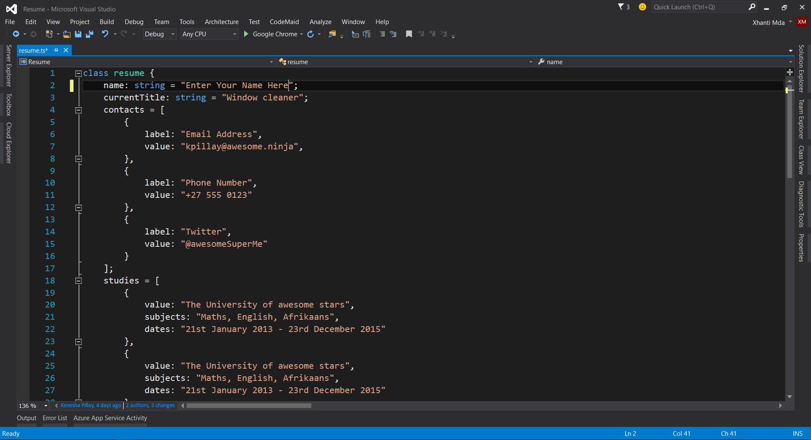

#### Step 3

To change current title find the currentTitle property in the resume class and change its value to your current job title.

#### Step 4

To change contacts find the contacts property in the resume class, you will notice that it contains three instances of a contact which are represented inside two curly-braces change the value of each property to your own.
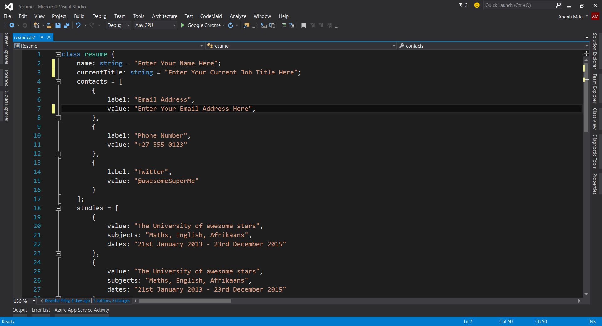

#### Step 5

To change studies find the studies property in the resume class, like the contacts property the studies property is a collection so you can either add more items to it or edit the exisiting items.
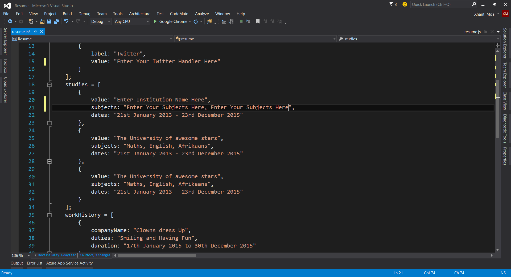

#### Step 6

To change work history find the work history property in the resume class. Change the values to own information.
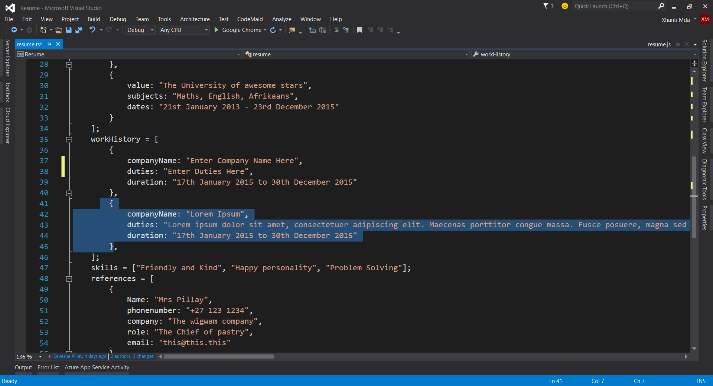

#### Step 7

To change skills you have to find the skills property in the resume class. You can either add, remove or replace the information with your own. 
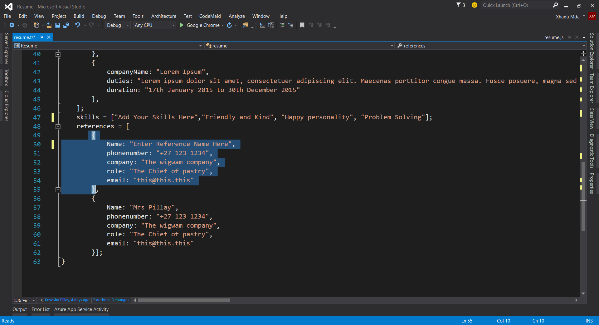

#### Step 8

To change references you have to find the references property in the resume class. You can either add, remove or replace the information with your own.

#### Step 9

To publish your changes to the Azure, go the Solution Explorer tab, right-click on the project and click publish on the context menu that pop-up.  
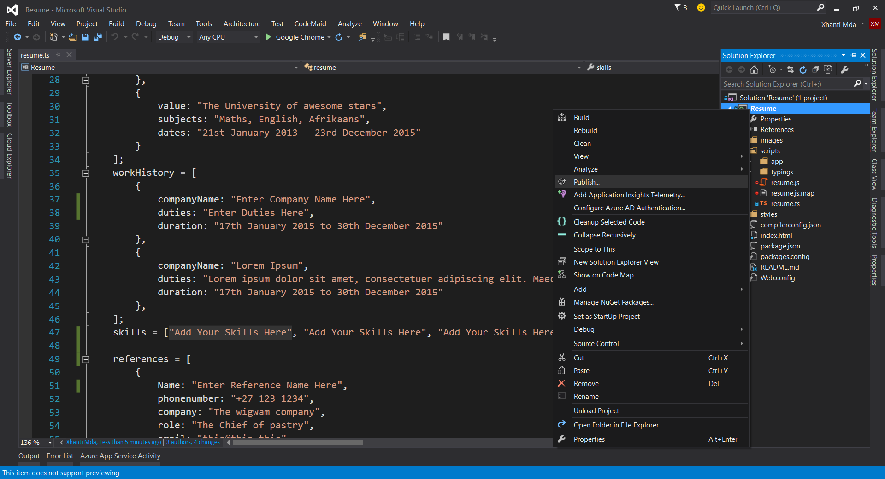

#### Step 10

On the Publish Web window that pops up, click on the Publish button.
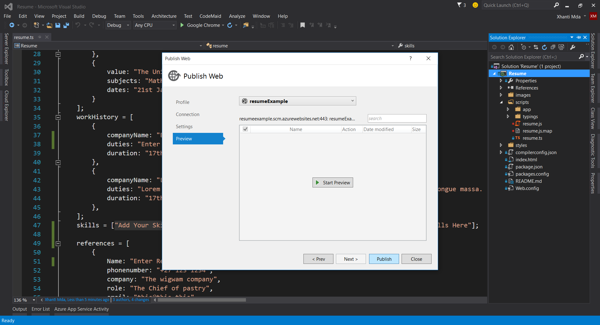

#### Step 11

A success message with your website URL will show up on the output window when the publish is done.
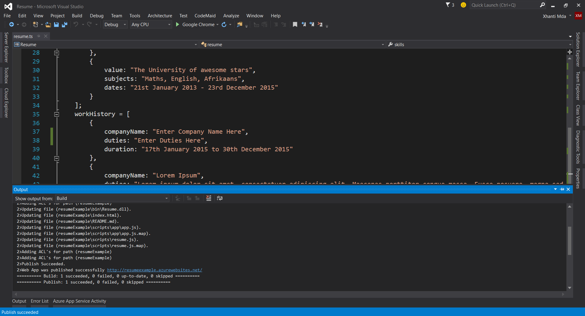

### Changing the colours

#### Step 1

Open the styles folder and click the site.less file to open it.

#### Step 2

In Less you can save colours as variables by using `@variableName: value;` syntax. So to add you own colours to the project create your own Less veriables with hexadecimal colour values.

#### Step 3

Assign the colour you created above to an element, choose the element you want to assign the colour to e.g background-color of the body. 
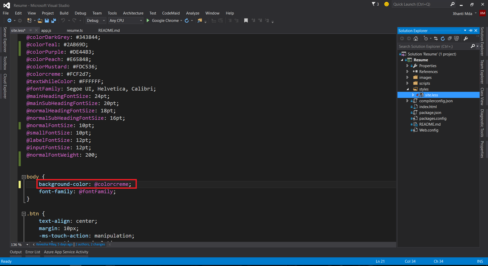

#### Installing Web Compiler

##### Step 1

Click on Tools →  Extensions and Updates

##### Step 2

On the Extensions and Updates window click on Online
 

##### Step 3

Search for Web Compiler and click on the Download button when it appears

##### Step 4

Wait for the download to finish, click the Install button to install.  
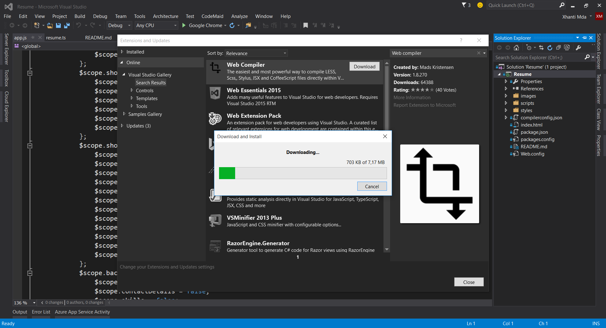

##### Step 5

Restart Visual Studio by clicking the Restart Now button.

##### Step 6 

Open the styles folder, right-click on the site.less file. Hover over Web Compiler and click on Re-compile file.

##### Step 7

To publish your changes to the Azure, go the Solution Explorer tab, right-click on the project and click publish on the context menu that pops up.  

##### Step 8

On the Publish Web window that pop-up, click on the Publish button.

##### Step 9

A success message with your website URL will show up on the output window when the publish is done.

### Troubleshooting

After your first publish you notice that angularjs and bootstrap breaks, to fix this problem replace the bootstrap and angularjs reference with their CDN links. 
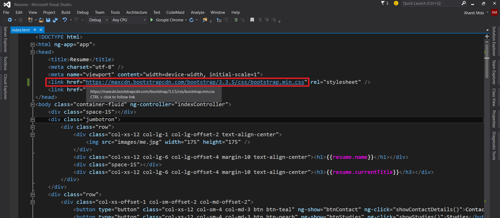

# Links

## Components &amp; Tools
- [Angular](https://angularjs.org)
- [Bootstrap](http://getbootstrap.com)
- [LESS](http://lesscss.org)
- [TypeScript](http://www.typescriptlang.org)
- [Visual Studio](https://www.visualstudio.com)
- [Azure](https://azure.microsoft.com)
- [Web Compiler](https://github.com/madskristensen/WebCompiler)