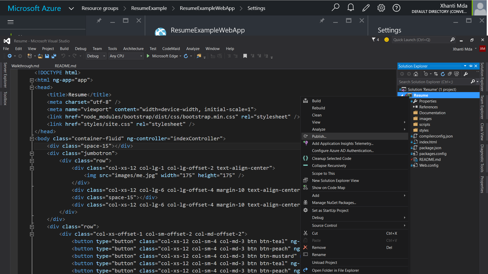
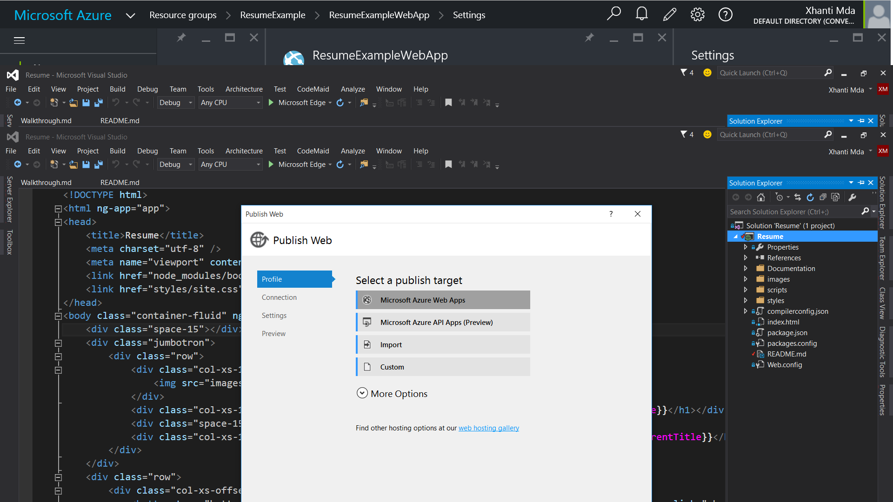
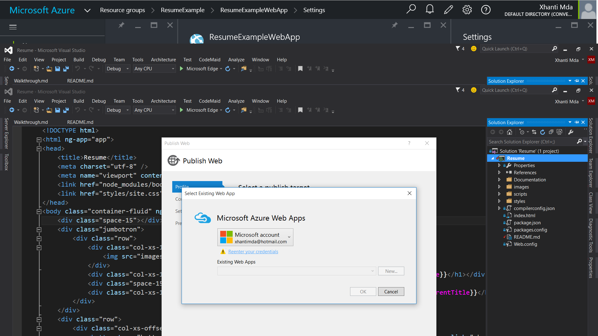
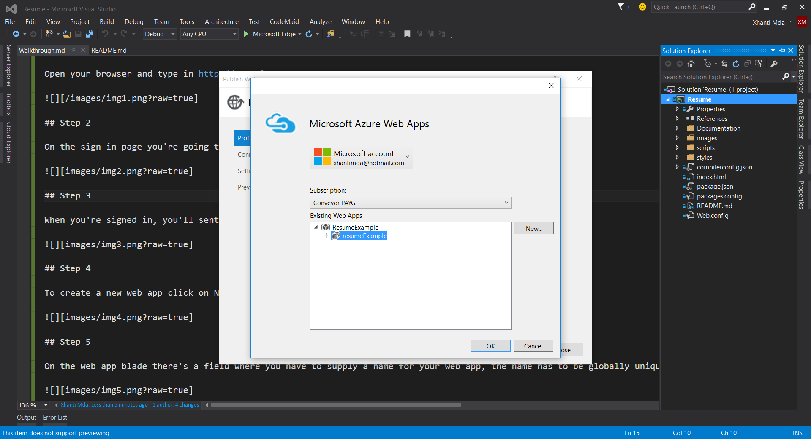
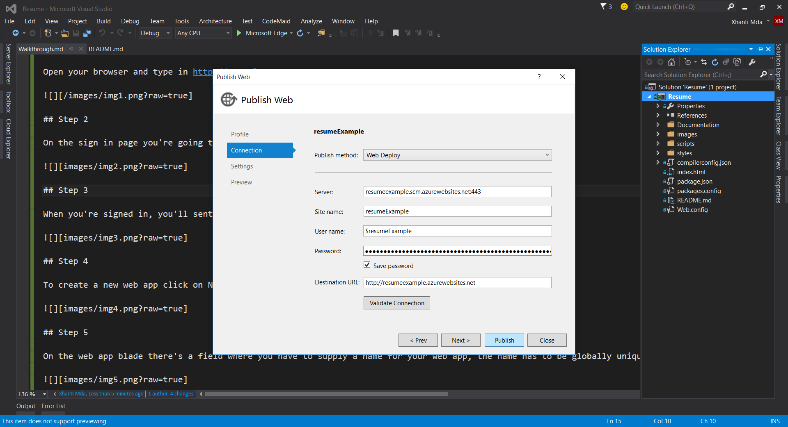
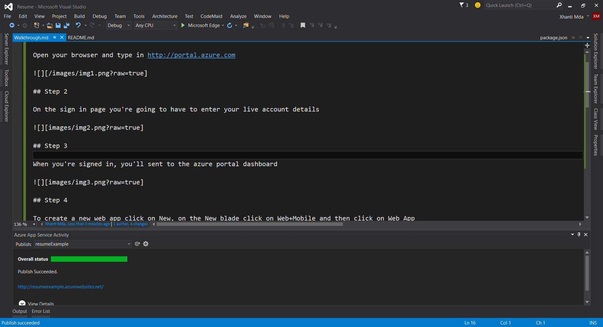

# Deploying Web Site To Azure

## Step 1

Open your browser and type in http://portal.azure.com

## Step 2

On the sign in page you're going to have to enter your live account details.

## Step 3

When you're signed in, you'll be sent to the azure portal dashboard.

## Step 4

To create a new web app click on New -> Web+Mobile -> Web App

## Step 5

On the web app blade there's a field where you have to supply a name for your web app, the name has to be globally unique because it will be used to make up part of your azurewebsites.net url. You also need to choose a subscription, resource group and a location before you can create the web app.

## Step 5

After creating your web app, it should be displayed as a tile on your dashboard, if it's not then you can click on Resource Groups to find it.

## Step 6

Open your project solution in Visual Studio, on the Solution Explorer Tab right-click on the project and click publish.

## Step 7 

On the window that pop-ups click on Microsoft Azure Web Apps

## Step 8

You may have to reenter your credentials to connect Visual Studio to your Azure subscription.

## Step 9

After Visual Studio connects to your Azure subscription, you should select the one you want and click ok.

## Step 10 

A window containing the details of the Azure Web App will pop-up, confirm if the information displayed there is correct then click publish to deploy the app. 

## Step 11

The output window will display a success message when the deploy is done.

